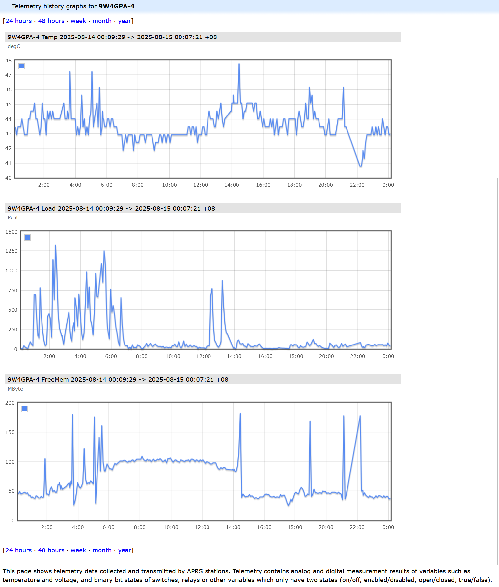

# RPi-APRS
With this simple python program you can monitor your Allstar or Pi-Star or WPSD health using APRS metrics.
You can see an example of the metrics logged by my Pi-Star node. [9W4GPA-4](https://aprs.fi/telemetry/a/9W4GPA-4?range=day)
The metrics are:-
1. Temperature
2. CPU load average
3. Available memory

## Installation (Pi-Star)
I have try to limit the number of dependencies in other python package but there is still a few that need to be installed.
The following instructions for installing `RPi-APRS` on Pi-Star.
On the Pi-Star image a very minimal version of python has been installed make sure the main python libraries are installed by running the following commands.
```
rpi-rw
sudo apt update && sudo apt install python3-pip -y
```
The following packages are the 3 dependencies used by `RPi-APRS`. They can be installed using the command pip.
```
sudo pip install ConfigParser aprslib humanize --break-system-packages
```
The module `ConfigParser` should be already installed but I have found some instances where it is not.
Clone this git and move into directory
```
git clone https://github.com/HafiziRuslan/RPi-APRS.git
cd RPi-APRS
```

### Installing RPi-APRS.py
```
sudo cp rpiaprs.py /usr/local/bin/rpiaprs
sudo chmod a+x /usr/local/bin/rpiaprs
```

### Installing the RPi-APRS service
```
sudo cp rpiaprs.service /lib/systemd/system/rpiaprs.service
sudo chmod 0644 /lib/systemd/system/rpiaprs.service
```

## Configurations
Copy the file `rpiaprs.conf` into `/etc`, and edit the informations using your favorite editor.
```
sudo cp rpiaprs.conf /etc/rpiaprs.conf
sudo nano /etc/rpiaprs.conf
```

## Starting the service
```
sudo systemctl enable rpiaprs.service
sudo systemctl start rpiaprs.service
```
You can now run the status command to see if everything is running
smoothly and you have no errors.
```
sudo systemctl status rpiaprs.service
```

## Example
This is the screenshoot from aprs.fi, of _temperature_, _load average_ and _free memory_ from an Pi-Star node.

